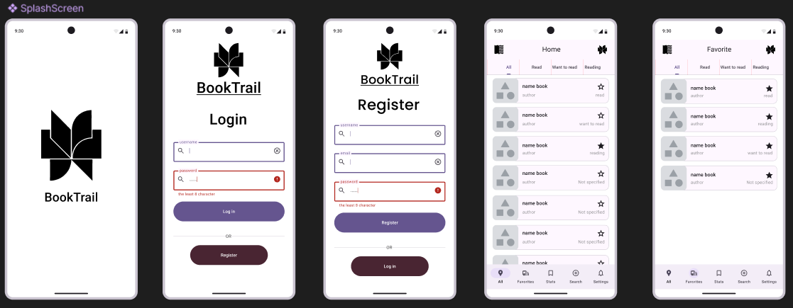
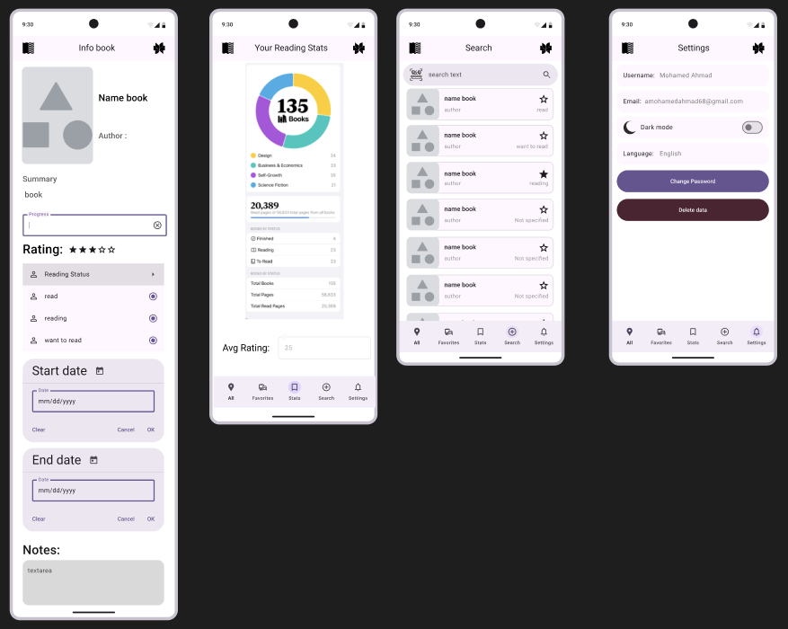

# 📚 BookTrail

**BookTrail** is a beautifully designed mobile application built with Flutter, created to help users track, manage, and enhance their reading experience in a modern and organized way.

---

## ✨ Features

- 📊 Track reading progress (pages read, start/end dates)
- 🗂️ Organize books by status: Read, Reading, Want to Read
- ⭐ Rate books (1–5 stars)
- 📝 Add personal notes and favorite quotes
- 📷 Upload a cover image or scan ISBN barcode
- 📚 Create custom book lists (e.g., "Favorites")
- 🌐 Search for books using the Google Books API
- 📈 View visual reading statistics and charts
- 🌙 Support for Dark Mode

---

## 📱 Screens Overview

- ✅ Splash Screen
- 🔐 Login & Register
- 🏠 Home (with tabs for All, Read, Reading, Want to Read)
- ⭐ Favorites
- 📘 Book Info
- 📊 Stats Screen
- 🔍 Search Screen
- ⚙️ Settings (Dark Mode, Language, Clear Data, Change password)




---

## 🚀 Getting Started

### Prerequisites

- Flutter SDK
- Dart SDK
- Android Studio or VS Code

### 1. Clone the repository

```bash
git clone https://github.com/mohamed-ahmad2/BookTrail.git
cd BookTrail
```

### 2. Install dependencies

```bash
flutter pub get
```

### 3. Run the app

```bash
flutter run
```

### 4. Upgrade dependencies

```bash
flutter pub upgrade
```

### 5. Upgrade flutter

```bash
flutter upgrade
```

---

## 👥 Team Workflow

- Each team member works on a separate branch:

```bash
git checkout -b feature/your-name
```

- Make changes → commit → push:

```bash
git add .
git commit -m "add: feature description"
git push origin feature/your-name
```

### 🔁 Merging a branch into `main`

Once you finish your feature:

1. Push your branch (if not already pushed):

```bash
git push origin feature/your-name
```

2.Go to the GitHub repo: [BookTrail](https://github.com/mohamed-ahmad2/BookTrail)
3.Click on **"Compare & pull request"**
4.Write a short description of what you added or changed
5.Click **"Create pull request"**
6.Another team member reviews and clicks **"Merge pull request"** into `main`

> Make sure you pulled the latest `main` before starting to avoid conflicts:

```bash
git checkout main
git pull origin main
```

> Then update your branch:

```bash
git checkout feature/your-name
git merge main
```

Resolve any conflicts before pushing.

---

🔗 [GitHub Repository](https://github.com/mohamed-ahmad2/BookTrail)
